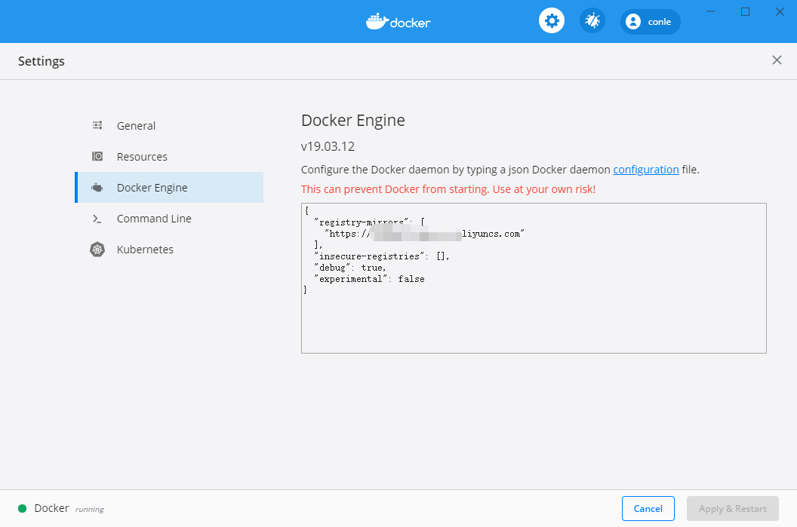

####简单搭建php+nginx环境

>如果有帮助到您  请点击右上角小心心 
>win 环境需要开启hyper-v 和vm冲突

1. 安装docker
   * [window下载路径](https://docs.docker.com/docker-for-windows/install/)
   * [mac下载路径](https://docs.docker.com/docker-for-mac/install/)
2. 镜像加速
   * 中国区官方镜像
      * https://registry.docker-cn.com
   * 网易
      * http://hub-mirror.c.163.com
   * 中国科技大学
      * https://docker.mirrors.ustc.edu.cn
   * ustc
      * https://docker.mirrors.ustc.edu.cn
   * 阿里云容器加速  (我用的是这种)
      * 登录 https://cr.console.aliyun.com/
      * 镜像加速器 创建  
      * 获得地址
3. 配置镜像加速器
   * win 如下图  mac 也一样
   * 把链接填入下方  多个逗号隔开

4. 下载Git Docker Demo
   * git clone https://github.com/conle/docker-nginx-php.git
5. 执行
   * docker-compose up -d --build
6. 环境搭建结束

7. sites-enabled 配置多域名即可访问项目

###注：
常用命令

命令|描述
---|---
docker-compose restart | 重启环境
docker-compose ps |查看容器状态
docker-compose stop |停止运行容器
docker images | 查看所有镜像
docker rmi <images id> |删除指定镜像
docker ps -a | 查看所有安装过的容器
docker ps | 查看所有运行中的容器
docker rm <container id/names> | 删除指定容器
docker stop <container id/names> |关闭运行中的容器
docker start <container id/names>| 开启容器
docker restart <container id/names>| 重启容器

容器 | 端口
--- | ---
nginx|80
php7.1fpm|8000
mysql|33060
   

